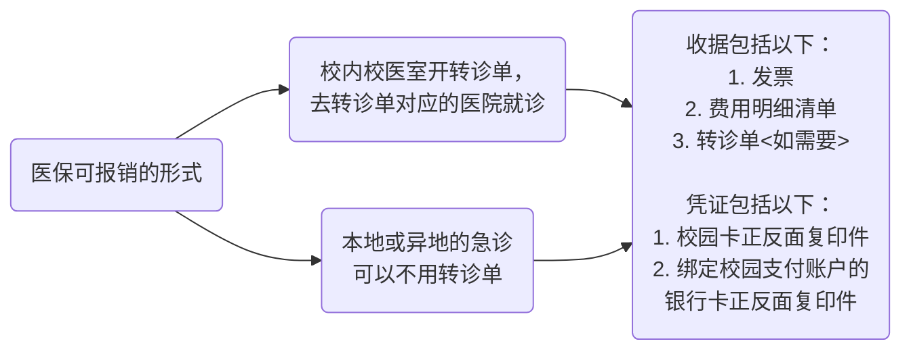

## 1. 广州大学生医保使用指南

> 华南理工大学的学生医保并没有定点医院这一说法，都是自费看病后带好相应的票据回学校校医室报销，注意统一报销时间，我现在所在的大学城校区是学期中每月14号早上。



注意看完病就及时在医院的自助打印机打印对应的收据，如果没有自助打印机或打印项目不全就去医院收费处询问工作人员，不然收据不全是不能报销的，还得重新回医院一趟。

---

## 2. Windows Powershell 中快速查找环境变量条目的方法

```powershell
# $env:PATH 打印此时终端加载的环境变量，一般包括系统变量和用户环境变量，有时
# 比如远程 ssh 时只会加载系统变量

# -split 的用法类似 python，就是按后面的参数字符换行
# 管道符 | 将打印的标准输出传给下一个命令

# Where-Object 是一个内置函数，$_ 表示该函数当前处理的那一行，在很多地方都有使用
# -like 能结合简单的通配符 * 匹配出现在行开头、行结尾、行内任意位置的字符串

$env:PATH -split ';' | Where-Object {$_ -like '*cargo*'}
```

`-like` 可以和 `-match` 做对比，前者更简单易用，后者可以使用更精确多样的正则表达式。
