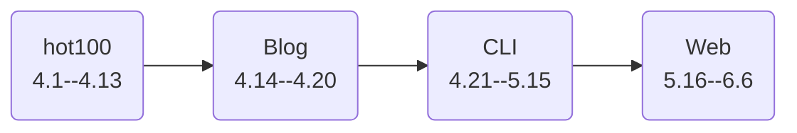

## 1. 一些规划

1. 我的首要目标是继续复习 leetcode 的 hot100，然后保持每日一题的手感，做好题解的记录。
2. 在复习完 hot100 之后，我想先着手重构一下我的博客网站，希望使用 Rust 作为后端服务，自从学了点异步和网络请求的皮毛之后还没真正实践过用 Rust 写些什么东西，正好最近写的笔记多了，也需要一个精简的博客网站展示一下。前端还是照例用 Typescript，数据库用 PostgreSQL（虽然用 MySQL 也差不多），缓存这一块就不上 Redis 了，应该也没什么并发。
3. 再之后想用 Rust 写写终端小工具，先复刻几个经典项目比如 grep、cat，然后在尝试能不能做出一些更现代的 CLI 工具，比如写写量化策略管理系统？
4. 之后写写求职项目吧，堆技术栈堆架构设计之类的，结合一下 RAG、Agent 概念，上一上 Redis、ES、Kafka 什么的。
5. 最后就是整理简历准备投暑期实习了，今年先去点中小厂，明年再积累积累水平争取去大厂暑期实习。

简单写写时间安排吧：

